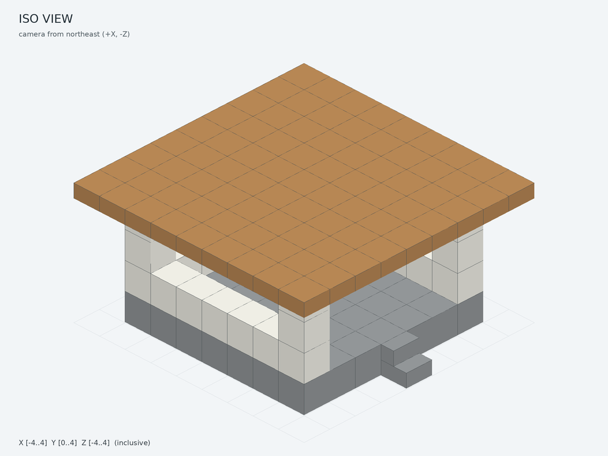

# Minecraft Spatial Kit

**Minecraft Spatial Kit** indexes bounded areas from local Minecraft Java world files, answers exact block queries, renders spatial previews, and exports blueprint JSON for [mc-builder](https://github.com/lucy-muyue/mc-builder). It is an offline file tool: it does not connect to a game server or place blocks.

[简体中文 README](README.zh-CN.md) · [Agent skill](skills/minecraft-spatial/SKILL.md) · [Indexing guide](docs/index.md) · [Rendering guide](docs/rendering.md) · [Rendering trade-offs](docs/rendering-decisions.md) · [Validation notes](docs/validation.md) · [Agent-to-builder workflow](docs/workflow.md)

For an agent workflow, read or copy [`skills/minecraft-spatial/`](skills/minecraft-spatial/) into the agent's skill directory. Server-side installation and configuration belong to [mc-builder](https://github.com/lucy-muyue/mc-builder): see its [README](https://github.com/lucy-muyue/mc-builder/blob/main/README.md) and [AGENT_BUILDING_GUIDE](https://github.com/lucy-muyue/mc-builder/blob/main/AGENT_BUILDING_GUIDE.md). Minecraft Spatial Kit exports local artifacts and does not install a server worker or edit server configuration.

## Preview the synthetic pavilion



```bash
python -m venv .venv
. .venv/bin/activate
python -m pip install -e .
mc-spatial demo --out ./pavilion-preview
```

The demo creates `scene.json`, `mc-builder-blueprint.json`, `model.glb`, four PNG views, three section images, and `render_manifest.json`. The example is a fictional open pavilion with an entrance, a bottom slab roof, and straight stairs. Its coordinates are invented.

## Inspect a world area

Minecraft block coordinates use **X east, Y up, Z south**. Every position also belongs to a named dimension. Bounds are inclusive: the `--min` and `--max` positions are both part of the region.

1. **Index the area you are working on.** Create or refresh the index at the start of a new inspection when the region of interest changes. Reuse the database when the world files are unchanged; source hashes let the index identify changed inputs. Use `--force` to reread files even when their hashes match. The detailed rules are in the [indexing guide](docs/index.md).

   ```bash
   mc-spatial index --world /path/to/world --db ./world-index.sqlite \
     --dimension minecraft:overworld --min -32 48 -32 --max 31 96 31
   ```

   For a custom-height dimension, pass its inclusive vertical limits with `--dimension-bounds MIN_Y MAX_Y`. The example values above are only command syntax; they do not describe a real site.

2. **Export a broad view and render it.**

   ```bash
   mc-spatial export --db ./world-index.sqlite --dimension minecraft:overworld \
     --min -32 48 -32 --max 31 96 31 --out ./scene.json
   mc-spatial render --scene ./scene.json --out ./scene-preview
   ```

   Open `views/iso.png` to understand height and shape, and `views/top.png` to inspect the footprint. Read `sections/x_mid.png`, `sections/y_mid.png`, and `sections/z_mid.png` to see the center cuts. Check `render_manifest.json` for coverage and geometry simplifications.

3. **Narrow the question.** Export a smaller box around an entrance, support, or route, or change the Y bounds to inspect another height layer. Render that focused Scene again, then query any point whose exact block or state matters:

   ```bash
   mc-spatial export --db ./world-index.sqlite --dimension minecraft:overworld \
     --min -8 48 -8 --max 8 72 8 --out ./scene-focus.json
   mc-spatial render --scene ./scene-focus.json --out ./scene-focus
   mc-spatial query --db ./world-index.sqlite --dimension minecraft:overworld --pos 0 64 0
   ```

   You can express index bounds as `--center X Y Z --radius RX RY RZ` instead of `--min/--max`. A position outside indexed coverage or inside a missing chunk is unknown. Source changes are discovered during a later `index` refresh; query reads the last indexed state and does not monitor the world. **Unknown is not air.**

The output files have distinct roles:

| File | Use |
|---|---|
| `scene.json` | Portable bounded data with dimension, inclusive bounds, palette, block positions, unknown chunks, and provenance. |
| `model.glb` | Static spatial model for a viewer; it is not a full in-game model. |
| `views/{iso,top,north,east}.png` | Overview images for shape, footprint, and side profile. |
| `sections/{x_mid,y_mid,z_mid}.png` | Center cuts through the exported bounds. |
| `render_manifest.json` | Source/coverage details, render method, and features represented approximately or omitted. |
| `mc-builder-blueprint.json` | Discrete block operations for a design; it does not include a site snapshot or construction authorization. |

See the [rendering guide](docs/rendering.md) for how to read the images and manifest, and the [trade-off note](docs/rendering-decisions.md) for the geometry choices.

## Design and export a building

An agent can turn the user's requested size, layout, and materials into an mc-builder operations JSON, then run:

```bash
mc-spatial blueprint --input ./building-plan.json --out ./building-review
```

Inspect the images and manifest, revise the same plan from feedback, and rerun with `--overwrite` to regenerate the review bundle. The exporter preserves exact block states, inclusive coordinates, and the dimension. Its `hollow` operation means “place the cuboid shell”; it does not clear existing blocks. Air targets are rejected.

The generated JSON follows [mc-builder's](https://github.com/lucy-muyue/mc-builder) blueprint format. Material allowlists, dimension limits, and site protections are checked by the user's local mc-builder preview. When the user has already authorized construction, continue through `preview_build → prepare_build → start_build → status/readback`. Minecraft Spatial Kit itself stops after creating review files. More detail is in [docs/workflow.md](docs/workflow.md).

The synthetic pavilion uses `minecraft:oak_slab`; a local mc-builder configuration must enable that material before its preview accepts the example.

## Install and develop

The project supports Python 3.10+ and depends on `nbtlib`, NumPy, Pillow, and trimesh. For repeatable local installation, use `requirements-lock.txt` alongside the package. CI exercises only synthetic data:

```bash
python -m unittest discover -s tests -v
```

Do not commit world folders, databases, region files, exact site coordinates, screenshots, or generated models from a private save. Public examples and CI data are synthetic.
